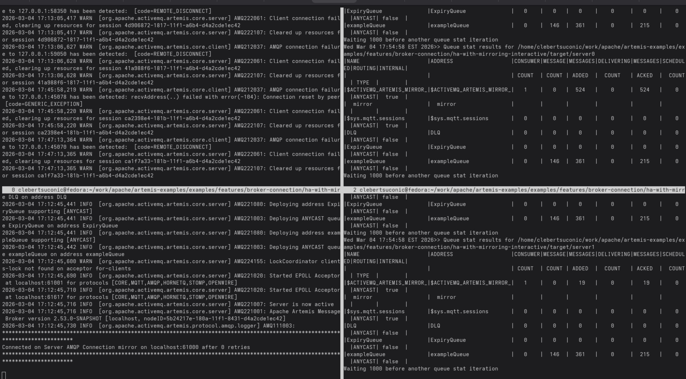
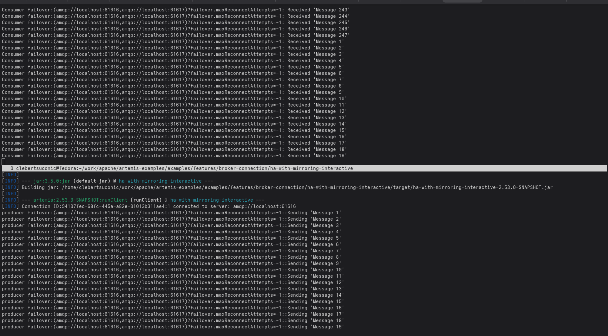

# High Availability with Dual Mirror and Distributed Locks

This example demonstrates how to achieve high availability (HA) using mirroring combined with distributed locks from the Lock Coordinator feature. The distributed locks ensure that only one broker accepts client connections at a time, providing automatic failover without split-brain scenarios.

## Overview

This example configures two brokers (server0 and server1) that:
- Mirror all messaging operations to each other using broker connections
- Share a distributed file-based lock to coordinate which broker accepts client connections
- Automatically failover client connections when the active broker fails

## How It Works

### Mirroring Configuration

Both brokers are configured with bidirectional mirroring using AMQP broker connections. Each broker mirrors its data to the other:

**server0/broker.xml:**
```xml
<broker-connections>
   <amqp-connection uri="tcp://localhost:61001" name="mirror" retry-interval="2000">
      <mirror sync="true"/>
   </amqp-connection>
</broker-connections>
```

**server1/broker.xml:**
```xml
<broker-connections>
   <amqp-connection uri="tcp://localhost:61000" name="mirror" retry-interval="2000">
      <mirror sync="false"/>
   </amqp-connection>
</broker-connections>
```

This ensures that messages, queues, and other operations are replicated across both brokers.

### Lock Coordinator for HA

The key feature of this example is the use of **distributed locks** to control which broker accepts client connections. Both brokers are configured with a lock coordinator on their client acceptors:

```xml
<lock-coordinators>
   <lock-coordinator name="clients-lock">
      <class-name>org.apache.activemq.artemis.lockmanager.file.FileBasedLockManager</class-name>
      <lock-id>mirror-cluster-clients</lock-id>
      <check-period>1000</check-period>
      <properties>
         <property key="locks-folder" value="/path/to/shared/locks"/>
      </properties>
   </lock-coordinator>
</lock-coordinators>

<acceptors>
   <acceptor name="forClients" lock-coordinator="clients-lock">tcp://localhost:61616</acceptor>
</acceptors>
```

The lock coordinator ensures that:
- Only the broker holding the lock accepts client connections on that acceptor
- If the active broker fails, the lock is automatically released and acquired by the other broker
- The backup broker immediately starts accepting connections when it acquires the lock
- The shared lock file prevents split-brain scenarios

### Client Failover

Clients connect using a failover URL that includes both broker addresses:

```java
ConnectionFactory factory = new org.apache.qpid.jms.JmsConnectionFactory(
   "failover:(amqp://localhost:61616,amqp://localhost:61617)?failover.maxReconnectAttempts=-1");
```

## Setup

## Running the Example

You have the following options to run this example:

### Non-interactive way

You can run this example in a non-interactive way, with HAWithDualMirrorExample starting, stopping the servers, and consume messages from your servers during failover.

```shell
mvn verify -automated
```
### Manual Execution

Start each server individually in separate terminals:

```shell
# Install servers
mvn install -Pcreate

# Terminal 1 - Start server0
cd target/server0/bin
./artemis run

#Terminal 2 - qstat on server0 (for better visualization)
cd target/server0/bin
./artemis queue stat --sleep 1000

# Terminal 3 - Start server1
cd target/server1/bin
./artemis run

#Terminal 4 - qstat on server1 (for better visualization)
cd target/server1/bin
./artemis queue stat --sleep 1000

# Terminal 4 - Start producer
mvn install -Pproducer

# Terminal 5 - Start consumer
mvn install -Pconsumer
```

### Screen Automation (Linux only)

For a better visual experience, use GNU Screen to automatically layout the terminals.

**Requirements:** Install screen on your Linux machine:
```shell
sudo dnf install screen  # Fedora/RHEL
# or
sudo apt install screen  # Debian/Ubuntu
```

**Start the servers:**
```shell
./screen-servers.sh
```

This will display:
- Server0 and Server1 running in the left column
- Queue statistics for both servers in the right column



**Start the clients:**
```shell
./screen-clients.sh
```

This will display:
- Consumer in the top pane
- Producer in the bottom pane



## Testing Failover

To observe the high availability in action:

1. Watch the producer sending messages and the consumer receiving them
2. Kill one of the servers (Ctrl+C in its terminal)
3. Observe that:
   - The client automatically reconnects to the surviving broker
   - Message flow continues without interruption
   - All messages are preserved due to mirroring
   - Interrupt consumers and see how message accumulation will affect mirroring and how messages are replayed after mirrors reconnect.
4. Restart the killed server and observe it reconnecting to each other.

## What to Observe

- **Lock Acquisition**: Only one broker will accept client connections at a time (the one holding the distributed lock)
- **Mirroring**: Messages sent to one broker are replicated to the other
- **Automatic Failover**: When the active broker fails, clients automatically reconnect to the backup

# Configuration Notes

The lock coordinator supports different lock types (file-based, zookeeper). This example uses file-based locks where both brokers must have access to a shared filesystem location.

The `check-period` parameter (in milliseconds) controls how frequently the lock holder verifies it still owns the lock, affecting how quickly failover occurs when a broker crashes.

## Change the configuration to ZooKeeper

If you want to try ZooKeeper, you need to change the lock-coordinator configuration. The class-name for the Lock Manager and the connect-string must be provided on server0 and server1.

```xml
<lock-coordinators>
   <lock-coordinator name="clients-lock">
      <class-name>org.apache.activemq.artemis.lockmanager.zookeeper.CuratorDistributedLockManager</class-name>
      <lock-id>mirror-cluster-clients</lock-id>
      <check-period>1000</check-period> <!-- how often to check if the lock is still valid, in milliseconds -->

      <properties>
         <property key="connect-string" value="localhost:2181"/>
      </properties>
   </lock-coordinator>
</lock-coordinators>
```

And of course you need to have ZooKeeper running for the broker. You can do that with Podman or Docker:

```shell
# you can replace podman with docker if you prefer, using the same arguments...
podman run -d --name zookeeper-artemis-test -p 2181:2181 zookeeper:latest
```
